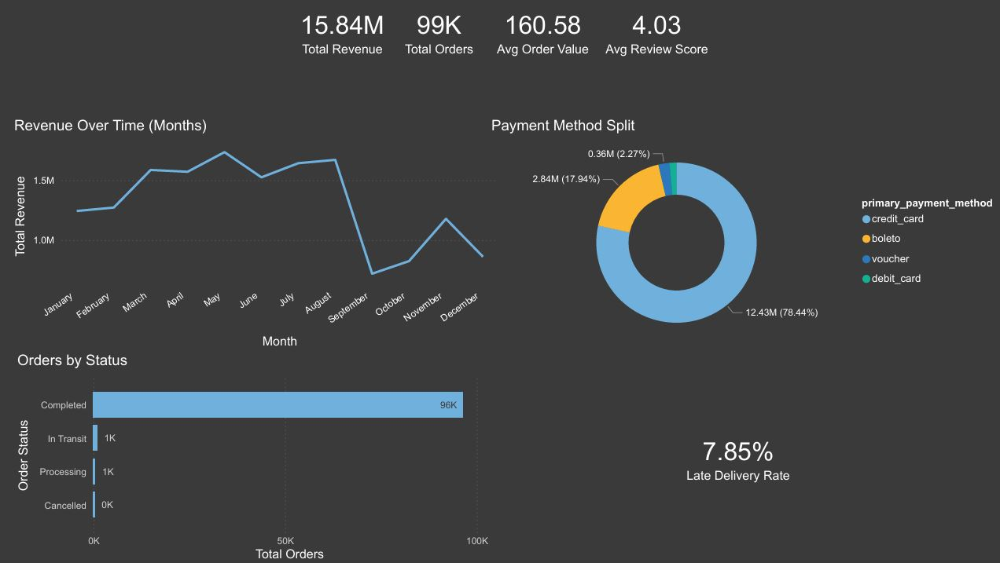
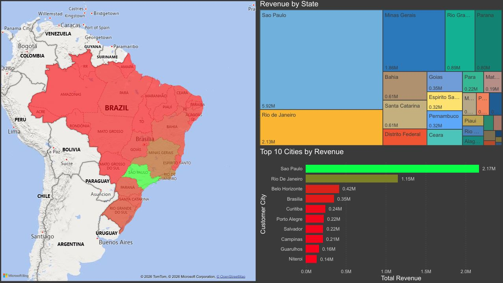
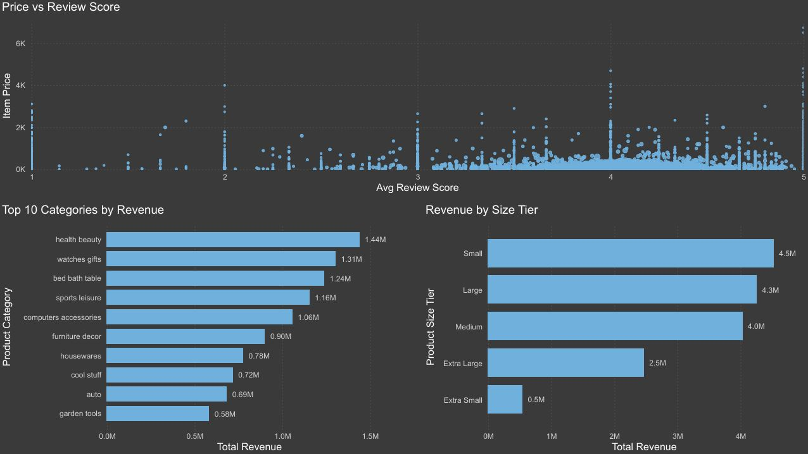
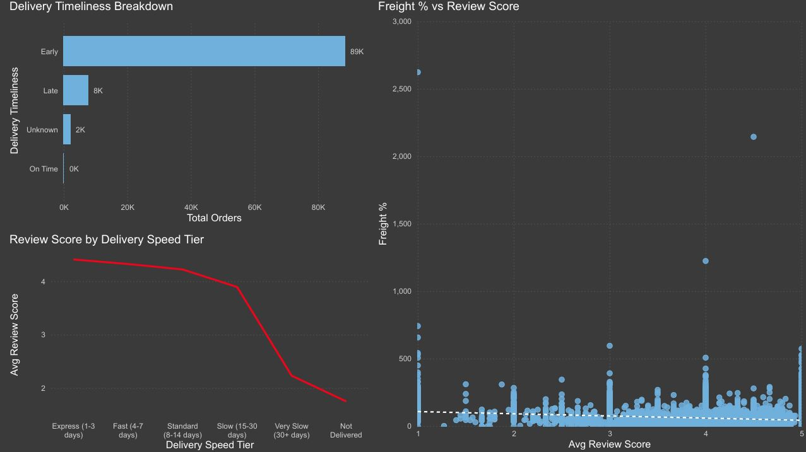

# Brazilian Ecommerce Project
This project is a full data pipeline built on the Olist Brazilian Ecommerce dataset from Kaggle. The raw CSV data across 9 files was imported into PostgreSQL, cleaned and transformed using advanced SQL, then modelled and visualised in Power BI.

## Tech Stack


## Project Pipeline

```
9 Raw CSV files (Kaggle)
       ↓
PostgreSQL (Staging, profiling, cleaning & transformation)
       ↓
3 Transformed Tables
  • fact_orders     (112k+ rows, one row per order line item)
  • dim_customers   (cleaned, geocoded, state names mapped)
  • dim_products    (translated categories, imputed dimensions, size tiers)
       ↓
Power BI (Star schema model, DAX measures, 4 page interactive report)
```

## SQL Transformation Highlights

The transformation script `CleanEcommerceData.sql` demonstrates:

- **CTEs** to break complex multi source logic into readable, auditable steps
- **`NTILE(4)` window function** for seller revenue quartile banding, this replaces the correlated subquery workaround required in SQLite
- **`ROW_NUMBER()` window function** to identify the primary payment method per order in a single table scan, without correlated subqueries
- **`PERCENTILE_CONT(0.5)`** for true median imputation of NULL product dimensions, this is more statistically robust than using averages on skewed data
- **`EXTRACT()` and `TO_CHAR()`** for clean timestamp decomposition into year, month, quarter and day name
- **EPOC based delivery durations** use `EXTRACT(EPOCH FROM (ts2 - ts1)) / 86400` for precise day level delivery calculations
- **`SUM() FILTER (WHERE ...)`** to pivot payment types into columns, which is cleaner and faster than `CASE WHEN` aggregations
- **Deduplication** of 1M geolocation rows down to 19k representative zip level coordinates via `AVG(lat/lng) GROUP BY zip`
- **Data quality flags** the `date_logic_error_flag` surfaces orders where delivery timestamp precedes purchase timestamp

---

## Report Pages & Key Insights

### Page 1: Executive Overview


*Total Revenue: R$15.84M | Late Delivery Impact Clearly Visible*

> High level business health across the full dataset

| KPI | Value |
|-----|-------|
| Total Revenue | R$ 15.84M |
| Total Orders | 99K |
| Avg Order Value | R$ 160.58 |
| Avg Review Score | 4.03 / 5 |
| Late Delivery Rate | 7.85% |

**Key Insights:**

- **Credit card dominates** at 78.44% of total revenue (R$ 12.43M), with boleto which is a Brazilian bank slip payment method used by consumers without traditional card access. This accounts for a further 17.94% (R$ 2.84M). This reflects Brazil's unique payments landscape and is a meaningful data point for any market entry analysis
- **96K out of 99K orders reached Completed status**, representing a 97% fulfilment rate which is a strong operational baseline
- The **7.85% late delivery rate represents approximately 7,800 orders** that missed their estimated delivery window. As Page 4 shows, late deliveries are the single biggest driver of negative reviews, which makes this the highest priority operational metric in the dataset

---

### Page 2: Customer & Geography


*São Paulo dominates 37% of total revenue*

> Revenue and order concentration across Brazil's 26 states

**Key Insights:**

- **São Paulo state dominates with R$ 5.92M** in revenue, this is nearly 3× more than Rio de Janeiro (R$ 2.13M) in second place, reflecting Brazil's extreme economic concentration in the south east
- **São Paulo city alone generated R$ 2.17M**, more than the entire states of Bahia, Santa Catarina, and Distrito Federal combined
- The filled map reveals a striking **north south revenue divide**: south eastern states (SP, RJ, MG) drive the overwhelming majority of revenue, while the vast northern states (Amazonas, Pará, Acre) show minimal activity, which are pointing to either significant untapped market potential or last mile logistics barriers in the north
- **Minas Gerais (R$ 1.86M)** and **Rio Grande do Sul (R$ 0.89M)** are the standout performers outside the São Paulo / Rio axis and represent the most viable expansion targets

---

### Page 3: Product Performance


*Scatter plot of item price vs avg review score (very slight positive), horizontal bars for top 10 categories by revenue (Health & Beauty leading), and revenue breakdown by product size tier (Small/Medium dominate). Insights show price has limited influence on satisfaction, while category and size drive volume.*

> Category level revenue and product data quality

**Key Insights:**

- **Health & Beauty** is the top revenue category at R$ 1.44M, followed by **Watches & Gifts** (R$ 1.31M) and **Bed, Bath & Table** (R$ 1.24M) — the top 3 are all lifestyle and discretionary purchases, not electronics or essentials as might be expected for an emerging ecommerce market
- **Small and Large size tier products** generate the most revenue (R$ 4.5M and R$ 4.3M respectively), while Extra Small products (R$ 0.5M) significantly underperform which suggests the platform is optimised for mid-to-large physical goods
- The **Price vs Review Score scatter plot shows no meaningful positive correlation** the higher priced items do not reliably generate better reviews, meaning product quality and delivery experience matter more to customers than price point alone

---

### Page 4: Delivery & Seller Performance


*89K early vs 8K late orders (bar), sharp decline in avg review score by delivery speed tier (line), and a weak negative correlation in freight % vs review score (scatter). Speed drives satisfaction much more than cost.*

> Operational efficiency and the link between logistics and customer satisfaction

**Key Insights:**

- **The standout finding of the entire dataset:** review scores show a clear, consistent decline as delivery speed worsens. Express deliveries (1–3 days) achieve the highest review scores, while Very Slow deliveries (30+ days) score lowest which confirms that delivery speed is the primary driver of customer satisfaction on the platform
- **89K orders arrived early vs only 8K late** yet that 8K generates a disproportionate share of negative reviews given the score drop associated with late delivery. Reducing late deliveries is the single highest leverage improvement available to Olist
- **Freight cost as a % of item price shows no strong correlation with review score** the customers are significantly less sensitive to what they pay for shipping than they are to how fast it arrives. Speed matters more than price
- The **seller revenue quartile analysis** confirms a heavy concentration of revenue in the top 25% of sellers, which is typical of marketplace dynamics but highlights platform dependency risk

---

## Power BI Data Model & Relationships

```
DateTable                                  dim_customers ─────── dim_products
(Date PK)                                  (customer_id PK)      (product_id PK)
Year                                       customer_city         product_category_english
Month / Month Name                         customer_state_full   product_size_tier
Quarter                                    latitude / longitude  product_weight_tier
Week                                       has_geolocation       product_volume_cm3
Day Name                                           │                         │
       │ One-to-Many                               │ Many-to-One             │ Many-to-One
       │                                           │                         │
       └───────────────────── fact_orders ─────────┴─────────────────────────┘
                              (order_id, order_item_id)
                              customer_id FK
                              product_id FK
                              seller_id
                              purchase_date FK → DateTable
                              order_status_group
                              actual_delivery_days
                              delivery_timeliness
                              delivery_speed_tier
                              item_price / freight_value / item_total
                              primary_payment_method
                              avg_review_score
                              review_sentiment
                              seller_revenue_quartile
```

## How to Use

**1. Clone the repository**
```bash
git clone https://github.com/kxsper/olist-ecommerce-analysis.git
```

**2. Download the dataset**

Download all 9 CSV files from [Kaggle](https://www.kaggle.com/datasets/olistbr/brazilian-ecommerce) and save them to a local folder e.g. `C:/olist/data/`

**3. Set up PostgreSQL**

Create a new database in pgAdmin called `olist`, open the Query Tool and run phase 0 from this file:
```bash
sql/CleanEcommerceData.sql
```
This creates all 9 staging tables ready to receive the CSV data.

**4. Import the CSVs**

For each table in pgAdmin:
- Right click the table → **Import/Export Data** → **Import**
- Select the corresponding CSV file
- Set **Header** to ON and **Encoding** to UTF8
- Click OK

**5. Run the transformation script**

In the Query Tool, run phases 1-6 from the same file from step 3:
```bash
sql/CleanEcommerceData.sql
```
This profiles the raw data, builds the 3 output tables (`fact_orders`, `dim_customers`, `dim_products`) and runs validation queries to confirm row counts and check for orphaned keys.

**6. Export to CSV for Power BI**

Right-click each output table in pgAdmin → **Import/Export Data** → **Export** → CSV, Header ON, Encoding UTF8. Or via psql:
```sql
\COPY fact_orders   TO 'C:/olist/fact_orders.csv'   CSV HEADER ENCODING 'UTF8';
\COPY dim_customers TO 'C:/olist/dim_customers.csv' CSV HEADER ENCODING 'UTF8';
\COPY dim_products  TO 'C:/olist/dim_products.csv'  CSV HEADER ENCODING 'UTF8';
```

**7. Open in Power BI**

Open `powerbi/olist_report.pbix` in Power BI Desktop. If prompted to reconnect data sources, point each table to the corresponding exported CSV.

## Files in this Repository

| File                                   | Description                                      |
|----------------------------------------|--------------------------------------------------|
| `compressed_fact_orders.csv.gz`        | Compressed fact_orders table due to size limits  |
| `dim_customers.csv`                    | Customer dimension table                         |
| `dim_products.csv`                     | Product dimension table                          |
| `olist_report.pbix`                    | Raw Power BI Desktop file                        |
| `olist_report.pdf`                     | 4 Report page visualisations                     |
| `CleanEcommerceData.sql`               | PostgreSQL file used to transform the data and generate the fact & dim tables |
| `README.md`                            | Current file                                     |


## Dataset 

**Source:** [Olist Brazilian E-Commerce Public Dataset — Kaggle](https://www.kaggle.com/datasets/olistbr/brazilian-ecommerce)

**Coverage:** 100,000 orders placed between 2016 and 2018 across Brazil

| Table | Rows |
|-------|------|
| olist_orders_dataset | 99,441 |
| olist_order_items_dataset | 112,650 |
| olist_order_payments_dataset | 103,886 |
| olist_order_reviews_dataset | 99,224 |
| olist_customers_dataset | 99,441 |
| olist_products_dataset | 32,951 |
| olist_sellers_dataset | 3,095 |
| olist_geolocation_dataset | 1,000,163 |
| product_category_name_translation | 71 |

---

*Dataset provided by Olist, the largest department store in Brazilian marketplaces.*
